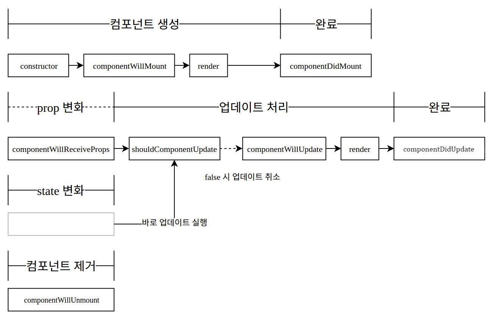

# react-basic

Velopert님 강의(https://velopert.com/reactjs-tutorials)을 연습하는 공간입니다.

## Package 설명
1. **babel** – 아직 ECMAScript6 를 지원하지 않는 환경에서 ECMAScript6 Syntax를 사용 할 수 있게 해줍니다.
2. **webpack** – 모듈 번들러로서, Browserify 처럼 브라우저 위에서 import (require) 을 할 수 있게 해주고 자바스크립트 파일들을 하나로 합쳐줍니다.
3. **webpack-dev-server** – wepback에서 지원하는 간단한 개발서버로서 별도의 서버를 구축하지 않고도 웹서버를 열 수 있으며 hot-loader를 통하여 코드가 수정될때마다 자동으로 리로드 되게 할 수 있습니다.

## JSX
### 장점
1. JSX는 컴파일링 되면서 최적화 되므로, 빠르다
2. Type-safe (어떠한 연산도 정의되지 않은 결과를 내놓지 않는것, 즉 예측 불가능한 결과를 나타내지 않는 것)하며 컴파일링 과정에서 에러를 감지 할 수 있다.
3. HTML에 익숙하다면, JSX를 사용하여 더 쉽고 빠르게 템플릿을 작성 할 수 있다.

```javascript
import React from 'react';
class App extends React.Component {
    render(){
        return (
                <h1>Hello Velopert</h1>
        );
    }
}
export default App;
```
React JSX 는 XML-like Syntax 를 native Javascript로 변환해줍니다.  따라서 ” ” 로 감싸지 않는 점 주의하시구요, ( ) 를 사용하지 않아도 오류는 발생하지 않지만 가독성을 위하여 사용하는것이 좋습니다.

### 확장자에 대해서
- JSX 파일의 확장자의 경우, 이전에는 개발자들이 .jsx 확장자를 사용하였지만 요즘은 .js 를 사용하는 추세로 전환되어 가고 있습니다. 페이스북의 오픈소스 에디터인 draftjs 는 구별을 제대로 하기 위하여 .react.js 확장자를 사용하기도 합니다. 

### Nested Elements
- 컴포넌트에서 여러 Element 를 렌더링 해야 할 때, 그 element들을 필수적으로 container element 안에 포함시켜줘야됩니다

```javascript
        // error
        return  (
            <h1> Hello Velopert</h1>
            <h2> Welcome </h2>
        );
```
다음과 같이 div element 를 wrapper 로 사용하면 오류가 발생하지 않습니다.
```javascript
        // success
        return  (
          <div>
            <h1> Hello Velopert</h1>
            <h2> Welcome </h2>
          </div>  
        );
```

### Javascript Expression
- JSX 안에서, JavaScript 표현을 사용하는 방법은 매우 간단합니다. 그냥 { } 로 wrapping 하면 됩니다.

```javascript
    sayHey(){
       alert("hey");
    }

    render(){
        let text = "Dev-Server";
        let pStyle = {
            color: 'aqua',
            backgroundColor: 'black'
        };
        return  (
            <div>
                <h1> Hello Velopert </h1>
                <h2> Welcome to {text}</h2>
                <button onClick={this.sayHey}>Click Me</button>
                <p style = {pStyle}>{1 == 1 ? 'True' : 'False'}</p>
            </div>
        );
    }
```
 ES6 에 도입된 let 키워드는 var 과 비슷하지만, var 변수의 scope는 기본적으로 함수 단위인데 let 은 블럭 범위 내에서 변수를 선언합니다. 따라서 가끔 발생하는 javascript 의 Scope관련 문제를 해결 할 수 있습니다. 지금 이 상황에선 let 을 사용하는것이 필수는 아니지만, ES6 에선 평상시 let 을 쓰고 var은 필요한 상황에서만 사용하는게 좋습니다. 
 <br />
 **{ text }** 를 사용하여 text Javascript 변수를 렌더링합니다.
 <br />
 **{this.sayHey}** 를 통해 버튼이 클릭되면 해당 메소드가 실행되게 할 수 있습니다. () 가 뒤에 안붙어있다는점을 주의해주세요. 만약에 () 가 붙으면 페이지가 로드 될때도 실행되고, 클릭할때도 실행됩니다. 
 <br />
 React의 Inline Style 에서는, string 형식이 사용되지 않고 **key 가 camelCase 인 Object 가 사용**됩니다.

#### if-else 사용불가
 - JSX 안에서 사용되는 JavaScript 표현에는 If-Else 문이 사용 불가합니다. 이에 대한 대안은 ternary (condition ? true : false ) 표현을 사용하는 것입니다.

 ```javascript
  <p>{1 == 1 ? 'True' : 'False'}</p>
 ```

### 주석
```javascript
{ /* comments */ }
```
- JSX 안에서 주석을 작성할 때엔, 위 형식으로 작성하면 됩니다. 여기에 작성된 주석은 브라우저상 source 에서 나타나지 않습니다.

## Component 생성 및 모듈화
- 하나의 js 파일안에 여러개의 컴포넌트를 만들수 있지만 유지보수가 좋지 않아서 js파일을 나누어서 관리하는게 좋습니다.
```javascript
// Header.js
import React from 'react';

class Header extends React.Component {
  render(){
    return (
      <h1>Header</h1>      
    );
  }
}

export default Header;
// Content.js
import React from 'react';

class Content extends React.Component {
  render() {
    return (
      <div>
        <h2>Content</h2>
        <p> Hey !</p>
      </div>
    )
  }
}

export default Content;

// App.js
import React from 'react';
import Header from './Header';
import Content from './Content';

class App extends React.Component {
    render(){
        return  (
            <div>
                <Header/>
                <Content/>
            </div>
        );
    }
}

export default App;

```

## props
컴포넌트에서 변동되지 않는(immutable) 데이터를 사용할때는 prpos를 사용한다. parent 컴포넌트에서 child 컴포넌트로 데이터를 전달할때 사용됩니다.
```javascript
// Header.js
import React from 'react';

class Header extends React.Component {
  render(){
    return (
      <h1>{this.props.title}</h1>      
    );
  }
}

export default Header;

// App.js
import React from 'react';
import Header from './Header';
import Content from './Content';

// 컴포넌트의 첫 문자를 대문자로 하는건 React의 naming convention 입니다.
class App extends React.Component {  
    render(){      
        return  (
            <div>
                <Header title={this.props.headerTitle} />
                <Content title={this.props.contentTitle}
                         body={this.props.contentBody}/>
                
            </div>
        )   
    }
}
export default App;

// index.js
import React from 'react';
import ReactDOM from 'react-dom';
import App from './components/App';

const rootElement = document.getElementById('root');
ReactDOM.render(<App headerTitle="Welcome !"
                     contentTitle="Stranger !"
                     contentBody="Welcomde to exapmle app"/>, rootElement);

```

### 디폴트 props 설정
- 기본값을 설정 할 땐, 컴포넌트 클래스 하단에 className.defaultProps = { propName: value } 를 삽입하면 됩니다.
```javascript
import React from 'react';
import ReactDOM from 'react-dom';
import Header from './Header';
import Content from './Content';

class App extends React.Component {
    render(){
        return  (
            <div>
                <Header title={ this.props.headerTitle }/>
                <Content title={ this.props.contentTitle }
                          body={ this.props.contentBody }/>
            </div>
        );
    }
}

App.defaultProps = {
    headerTitle: 'Default header',
    contentTitle: 'Default contentTitle',
    contentBody: 'Default contentBody'
};

export default App;
```
### Type검증(Validate)
 - 컴포넌트 에서 원하는 props 의 Type 과 전달 된 props 의 Type 이 일치하지 않을 때 콘솔에서 오류 메시지가 나타나게 하고 싶을 땐, 컴포넌트 클래스의 propTypes 객체를 설정하면 됩니다. 또한, 이를 통하여 필수 props 를 지정할 수 있습니다. 즉, props 를 지정하지 않으면 콘솔에 오류 메시지가 나타납니다.

```javascript
import React from 'react';
 

class Content extends React.Component {
    render(){
        return (
            <div>
                <h2>{ this.props.title }</h2>
                <p> { this.props.body } </p>
            </div>
        );
    }
}

Content.propTypes = {
    title: React.PropTypes.string,
    body: React.PropTypes.string.isRequired
};

export default Content;
```
body는 .isRequired 를 추가하여 필수 props 로 설정하였습니다.


#### propTypes 사용법이 react v15.5.0에서 변경됨 
```javascript
import React from 'react';
import PropTypes from 'prop-types';

class Content extends React.Component {
  render() {
    return (
      <div>
        <h2>{this.props.title}</h2>
        <p> {this.props.body}</p>
      </div>
    )
  }
}

Content.propType = {
  title : PropTypes.string,
  body : PropTypes.string.isRequired
}

export default Content;
```


#### propTypes 예제들
```javascript
import React from 'react';


class ValidationExample extends React.Component {
    /* ... */
}

Content.propTypes = {

    // JS primitive types
    optionalArray: React.PropTypes.array,
    optionalBool: React.PropTypes.bool,
    optionalFunc: React.PropTypes.func,
    optionalNumber: React.PropTypes.number,
    optionalObject: React.PropTypes.object,
    optionalString: React.PropTypes.string,

    // anything that can be rendered ( numbers, string, elements, array, fragment)
    optionalNode: React.PropTypes.node,

    // React element
    optionalElement: React.PropTyps.element,

    // instance of specific class
    optionalMessage: React.PropTypes.instanceOf(Message),

    // limited to specific values
    optionalEnum: React.PropTypes.oneOf(['News', 'Photos']),

    // one of many types
    optionalUnion: React.PropTypes.oneOfType([
        React.PropTypes.string,
        React.propTypes.number
    ]),

    // array of specific type
    optionalArrayOf: React.PropTypes.arrayOf(React.PropTypes.number),

    // object with property values of a certain type
    optionalObjectOf: React.PropTypes.objectOf(React.PropTypes.number),

    // object with particular shape
    optionalObjectWithShape: React.PropTypes.shape({
        color: React.PropTypes.string,
        fontSize: React.PropTypes.number
    }),

    // Required function
    requiredFunc: React.PropTypes.func.isRequired,

    // Required prop with any data type
    requiredAny: React.PropTypes.any.isRequired,

    // custom validator
    customProp: function(props, propName, componentName) {
      if (!/matchme/.test(props[propName])) {
        return new Error('Validation failed!');
      }
    }
};
/* ... */

export default ValidationExample;

```

## state
컴포넌트에서 유동적인 데이터를 다룰 때, state 를 사용합니다. React.js 어플리케이션을 만들 땐, state를 사용하는 컴포넌트의 갯수를 최소화 하는 것 을 노력해야합니다. 예를들어, 10 개의 컴포넌트에서 유동적인 데이터를 사용 하게 될 땐, 각 데이터에 state를 사용 할 게 아니라, props 를 사용하고 10 개의 컴포넌트를 포함시키는 container 컴포넌트를 사용하는것이 효율적입니다.

```javascript
import React from 'react';

class StateExample extends React.Component {
  constructor(porps) {
    super(props);
    this.state = {
      header : 'Header init state',
      content : 'content init state'
    };
  }
  updateHeader(text){
    this.setState({
      header:'Header has change'
    });
  }

  render() {
    return (
        <div>
          <h1>{this.state.header}</h1>
          <h2>{this.state.content}</h2>
          <button onClick={this.updateHeader.bind(this)}>update</button>
        </div>
    );
  }
}
export default StateExample;
```
- state 의 초기 값을 설정 할 때는 constructor(생성자) 메소드에서 this.state= { } 를 통하여 설정합니다.
- state 를 렌더링 할 때는 { this.state.stateName } 을 사용합니다.
- state 를 업데이트 할 때는 this.setState() 메소드를 사용합니다. ES6 class에선 auto binding이 되지 않으므로, setState 메소드를 사용 하게 될 메소드를 **bind** 해주어야 합니다. (bind 하지 않으면 React Component 가 가지고있는 멤버 함수 및 객체에 접근 할 수 없습니다.)

### ※ props 와 state, 생긴건 비슷하지만 용도는 다릅니다. 헷갈리지 않도록 다음 특성을 기억하세요.
- parent 컴포넌트에 의해 값이 변경 될 수 있는가? 예(props) 아니오(state) 
- 컴포넌트 내부에서 변경 될 수 있는가? 아니오(props) 예(state) 

### ※ state 안의 array 에 원소 삽입/제거/수정
this.state 에 포함된 배열에 원소를 삽입/제거/수정 을 할 때 그 배열에 직접 접근하면 안됩니다. <br>
예를들어, 원소를 추가 할 때 배열객체의 push() 메소드를 사용하면 원하는대로 되지 않습니다. <br>
this.state가 변경된다고해서 컴포넌트가 업데이트되지 않기 때문입니다.
물론 변경 후 React 컴포넌트 API 인 forceUpdate()를 통하여 컴포넌트가 render()를 다시 실행 하게 끔 하는 방법이 있긴하지만 이건 절대 권장되지 않는 방법입니다.<br>
React 메뉴얼 에서도  this.state를 직접 수정하지 말고 this.setState()를 사용하여 수정 할 것을 강조합니다.<br>
(이 메소드가 실행되면 자동으로 re-rendering 이 진행됩니다.)

#### 삽입 
state 내부의 배열에 원소를 추가하는 방법은 다음과 같습니다.
```javascript
this.setState({
    list: this.state.list.concat(newObj)
})
// concat 을 사용함으로서 현재의 list 배열에 newObj 원소를 추가한 새로운 배열을 생성 한 후, 그 값을 현재의 list 로 설정합니다.
```
배열을 수정 할 땐 원시적인 방법으론 위와 같이 배열 전체를 복사하고 처리 후 기존 값에 덮어씌우는 과정을 거쳐야 합니다.<br>
허나, 만약에 배열의 크기가 클 땐 성능이 좀 저하되겠죠?

다른 방법으로는 Immutability Helpers 를 사용하는 방법이 있습니다.
이는 배열을 더 효율적으로 수정 할 수 있게 해주는 페이스북의 Immutable-js  를 사용합니다.

#### Immutability Helpers
React 구버전에서는 해당 라이브러리가 내장되어import React from 'react/addons'; 으로 React를 import 하여 React.addons.update() 를 사용 할 수 있었으나, 이제 이 방법은 deprecated 되었습니다.<br>
아직도 이렇게 사용은 가능 하나, 브라우저 상에서 ‘react-addon-update’ 를 import 하라고 권장하는 오류 메시지가 발생합니다.

라이브러리 설치 방법
- $ npm install --save react-addons-update 를 통하여 라이브러리를 저장 후,
js 파일 상단에 import update from 'react-addons-update' 를 삽입해줍니다.
```javascript
// 삽입
this.setState({
    list: update(
              this.state.list, 
              {
                  $push: [newObj, newObj2]
              }
});
// 삭제
this.setState({
    list: update(
              this.state.list, 
              {
                  $splice: [[index, 1]]
              }
});
// 수정
// 아래 코드는 list 배열의 index 번째 아이템의 field 와 field2 의 값을 변경합니다.
this.setState({
    list: update(
              this.state.list, 
              {
                  [index]: {
                      field: { $set: "value" },
                      field2: { $set: "value2" }
                  }
              }
});

```


## Array.prototype.map
map() 메소드는 파라미터로 전달 된 함수를 통하여 배열 내의 각 요소를 프로세싱 하여 그 결과로 새로운 배열을 생성합니다
```javascript
arr.map(callback, [thisArg])
```
파라미터 <br/>
callback 새로운 배열의 요소를 생성하는 함수로서, 다음 세가지 인수를 가집니다.
- currentValue 현재 처리되고 있는 요소
- index 현재 처리되고 있는 요소의 index 값
- array 메소드가 불려진 배열
thisArg (선택항목) callback 함수 내부에서 사용 할 this 값을 설정

예제
```javascript
var numbers = [1, 2, 3, 4, 5];
var processed = numbers.map(function(num){
    return num*num;
});
/*
 // ES6 문법
let numbers = [1, 2, 3, 4, 5];
let result = numbers.map((num) => {return num*num});
*/
```

## 컴포넌트의 LifeCycle API 
 **LifeCycle API**는, 컴포넌트가 DOM 위에 생성되기 전 후 및 데이터가 변경되어 상태를 업데이트하기 전 후로 실행되는 메소드 들 입니다.
 
 이 메소드를 왜 쓰겠어.. 쓸일이 있겠어.. 라고 생각 하실 수 있는데,가끔 이를 사용하지 않으면 해결 할 수 없는 난관에 가끔 부딪치기도 때문에  잘 알아뒀다가 필요 할 때 사용하는것이 좋습니다.

### 정리
컴포넌트를 생성 할 때는 constructor -> componentWillMount -> ender -> componentDidMount 순으로 진행됩니다.

컴포넌트를 제거 할 때는 componentWillUnmount 메소드만 실행됩니다.

컴포넌트의 prop이 변경될 때엔 componentWillReceiveProps -> shouldComponentUpdate -> componentWillUpdate-> render -> componentDidUpdate 순으로 진행됩니다.

state가 변경될 떄엔 props 를 받았을 때 와 비슷하지만 shouldComponentUpdate 부터 시작됩니다.



### 상세설명

constructor : 생성자 메소드로서 컴포넌트가 처음 만들어 질 때 실행됩니다.이 메소드에서 기본 state 를 정할 수 있습니다.

componentWillMount : 컴포넌트가 DOM 위에 만들어지기 전에 실행됩니다.

render : 컴포넌트 렌더링을 담당합니다.

componentDidMount : 컴포넌트가 만들어지고 첫 렌더링을 다 마친 후 실행되는 메소드입니다.이 안에서 다른 JavaScript 프레임워크를 연동하거나, setTimeout, setInterval 및 AJAX 처리 등을 넣습니다

componentWillReceiveProps : 컴포넌트가 prop 을 새로 받았을 때 실행됩니다. prop 에 따라 state 를 업데이트 해야 할 때 사용하면 유용합니다. 이 안에서 this.setState() 를 해도 추가적으로 렌더링하지 않습니다.
```javascript
componentWillReceiveProps(nextProps){
    console.log("componentWillReceiveProps: " + JSON.stringify(nextProps));
}
```
shouldComponentUpdate : prop 혹은 state 가 변경 되었을 때, 리렌더링을 할지 말지 정하는 메소드입니다. 위 예제에선 무조건 true 를 반환 하도록 하였지만, 실제로 사용 할 떄는 필요한 비교를 하고 값을 반환하도록 하시길 바랍니다. 

예: return nextProps.id !== this.props.id;

JSON.stringify() 를 쓰면 여러 field 를 편하게 비교 할 수 있답니다
```javascript
shouldComponentUpdate(nextProps, nextState){
    console.log("shouldComponentUpdate: " + JSON.stringify(nextProps) + " " + JSON.stringify(nextState));
    return true;
}
```
componentWillUpdate : 컴포넌트가 업데이트 되기 전에 실행됩니다. 이 메소드 안에서는 this.setState() 를 사용하지 마세요 – 무한루프에 빠져들게 됩니다.
```javascript
componentWillUpdate(nextProps, nextState){
    console.log("componentWillUpdate: " + JSON.stringify(nextProps) + " " + JSON.stringify(nextState));
}
```
componentDidUpdate : 컴포넌트가 리렌더링을 마친 후 실행됩니다.
```javascript
componentDidUpdate(prevProps, prevState){
    console.log("componentDidUpdate: " + JSON.stringify(prevProps) + " " + JSON.stringify(prevState));
}
```
componentWillUnmount : 컴포넌트가 DOM 에서 사라진 후 실행되는 메소드입니다.
```javascript
componentWillUnmount(){
    console.log("componentWillUnmount");
}
```